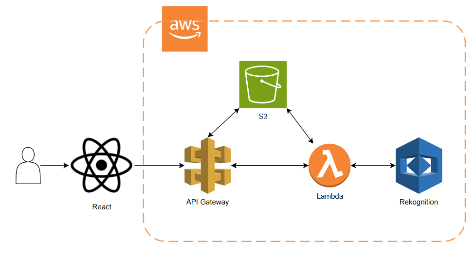
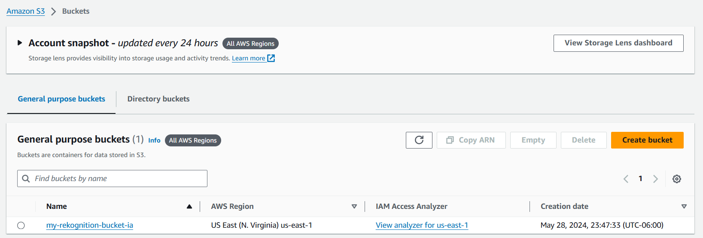
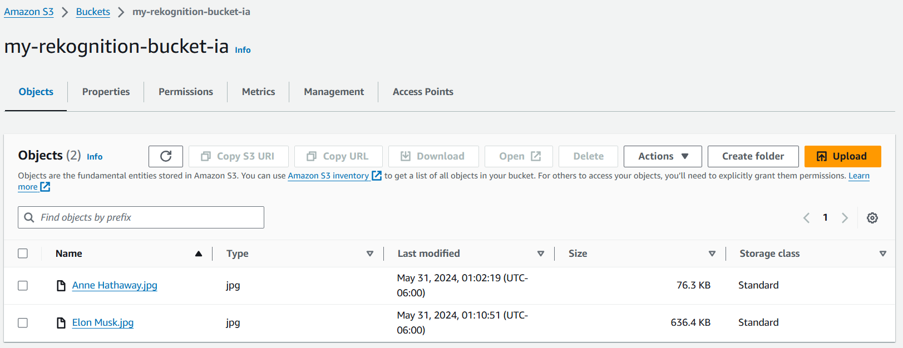
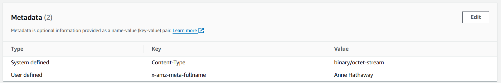
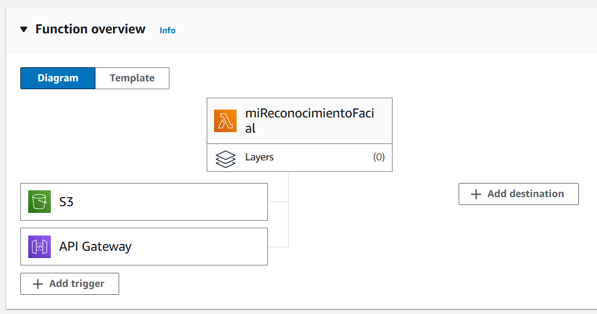
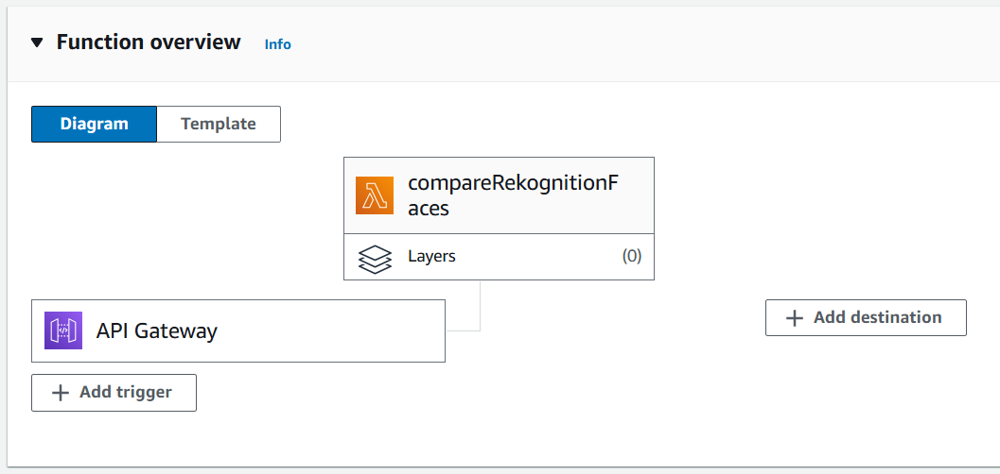
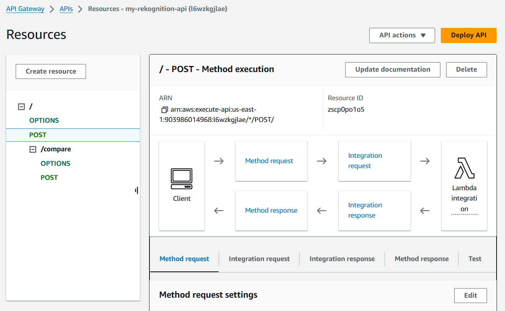

# Manual Técnico

- [Manual Técnico](#manual-técnico)
  - [Arquitectura](#arquitectura)
  - [S3](#s3)
    - [Procesamiento de datos](#procesamiento-de-datos)
    - [Bucket](#bucket)
      - [Objects](#objects)
      - [Metadatos](#metadatos)
  - [Rekognition](#rekognition)
    - [Detección y análisis de rostros](#detección-y-análisis-de-rostros)
      - [compare\_faces](#compare_faces)
  - [Funciones Lambda](#funciones-lambda)
    - [Agregar Rostro](#agregar-rostro)
    - [Compara Rostro](#compara-rostro)
  - [API GATEWAY](#api-gateway)
    - [Agregar Rostro](#agregar-rostro-1)
    - [Comparar Rostro](#comparar-rostro)


##  Arquitectura



## S3

Amazon Simple Storage Service (Amazon S3) es un servicio de almacenamiento de objetos que ofrece escalabilidad, disponibilidad de datos, seguridad y rendimiento líderes del sector. Los clientes de todos los tamaños y sectores pueden utilizar Amazon S3 para almacenar y proteger cualquier cantidad de datos para diversos casos de uso, tales como lagos de datos, sitios web, aplicaciones móviles, copia de seguridad y restauración, archivado, aplicaciones empresariales, dispositivos IoT y análisis de big data.

### Procesamiento de datos
Para transformar datos y activar flujos de trabajo para automatizar una variedad de otras actividades de procesamiento a escala, puede utilizar las siguientes características.

S3 Object Lambda: agregue su propio código a las solicitudes GET, HEAD y LIST de S3 para modificar y procesar los datos a medida que vuelven a una aplicación. Filtra filas, redimensiona dinámicamente las imágenes, redacta datos confidenciales y mucho más

### Bucket

Un bucket es un contenedor para objetos almacenados en Amazon S3. Puede almacenar cualquier cantidad de objetos en un bucket y puede tener hasta 100 buckets en su cuenta.



#### Objects
Los objetos son las entidades fundamentales almacenadas en Amazon S3. Los objetos se componen de datos de objetos y metadatos.



#### Metadatos

Puede establecer metadatos de objeto en Amazon S3 en el momento de cargar el objeto. Los metadatos de objetos son un conjunto de pares nombre-​valor. Tras cargar el objeto, no puede modificar sus metadatos. La única manera de modificar los metadatos de un objeto es realizar una copia del mismo y configurar sus metadatos.

Al cargar un objeto, también puede asignar metadatos al objeto. Esta información opcional se facilita como par nombre-valor (clave-valor) al enviar una solicitud PUT o POST para crear el objeto. Cuando se cargan objetos con la API de REST, los nombres opcionales de metadatos definidos por el usuario deben comenzar con “x-amz-meta-” para distinguirlos de otros encabezados HTTP.



## Rekognition

### Detección y análisis de rostros 

Amazon Rekognition le proporciona API que puede utilizar para detectar y analizar rostros en imágenes y vídeos. En esta sección, se ofrece una descripción general de las operaciones no relacionadas con el almacenamiento para el análisis facial. Estas operaciones incluyen funcionalidades como la detección de puntos de referencia faciales, el análisis de emociones y la comparación de rostros.

#### compare_faces


Si la imagen de origen contiene varios rostros, el servicio detecta el rostro más grande y lo compara con cada rostro detectado en la imagen de destino.

CompareFaces también devuelve una serie de caras que no coinciden con la imagen de origen. Para cada cara, devuelve un cuadro delimitador, valor de confianza, puntos de referencia, detalles de pose y calidad. La respuesta también devuelve información sobre el rostro en la imagen de origen, incluido el cuadro delimitador del rostro y el valor de confianza.

Si la imagen no contiene metadatos Exif, CompareFaces devuelve información de orientación para las imágenes de origen y de destino. Utilice estos valores para mostrar las imágenes con la orientación de imagen correcta.

Si no se detectan caras en las imágenes de origen o de destino, CompareFaces devuelve un error InvalidParameterException.

Solicitar sintaxis

```python
rekognition.compare_faces(
                SourceImage={
                    'Bytes': source_image_bytes
                },
                TargetImage={
                    'S3Object': {
                        'Bucket': bucket_name,
                        'Name': target_image_name
                    }
                }
            )
```

##  Funciones Lambda

### Agregar Rostro

[Lambda function: Agregar Rostro](Backend/agregar_rostro.py)



### Compara Rostro

[Lambda function: Comparar Rostro](Backend/comparar_rostro.py)



## API GATEWAY



### Agregar Rostro

Método `POST`

Ruta

    {url}

Body

```json
{
  "fileName": "string",
  "fullName": "string",
  "file": "string"
}
```


Ejemplo

```json
{
  "fileName": "Anthony_Son.jpeg",
  "fullName": "Anthony Son",
  "file": "/9j/4AAQSkZJRgABAQAAAQABAAD/.../+yK35ENfiQu5luB3lVg4b/9k="
}
```

Respuesta Esperada

Status Code: `200 OK`

```json
{
    "statusCode": 200,
    "body": "{\"message\": \"File uploaded successfully\", \"fileName\": \"Anthony_Son.jpeg\"}"
}
```

### Comparar Rostro

Método `POST`

Ruta

    {url}/compare

Body

```json
{
  "source_image": "string"
}
```


Ejemplo

```json
{
  "source_image": "/9j/4AAQSkZJRgABAQAAAQABAAD/.../+yK35ENfiQu5luB3lVg4b/9k="
}
```

Respuesta Esperada

Status Code: `200 OK`

```json
{
    "statusCode": 200,
    "body": "{\"message\": \"Match found\", \"matched_image_metadata\": {\"matched_image_name\": \"Anthony_Son.jpeg\", \"matched_image_confidence\": 100.0, \"matched_image_fullname\": \"Anthony Son\"}}"
}
```