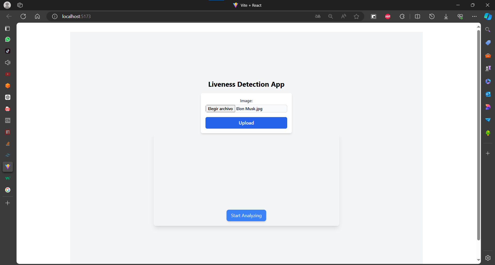

# Manual de Usuario

- [Manual de Usuario](#manual-de-usuario)
  - [Diseño de la página](#diseño-de-la-página)
  - [Funcionalidades](#funcionalidades)
  - [Agreagr nuevo rostro](#agreagr-nuevo-rostro)
  - [Analizar Rostro](#analizar-rostro)

## Diseño de la página

## Funcionalidades

## Agreagr nuevo rostro

Formulario para cargar imagen. 

Extensiones: `.png`, `.jpeg`, `jpg`

El nombre de la imagen debe corresponder al rostro de la imagen.

## Analizar Rostro

Pasos para analizar rostro:
-   Dar permiso para poder acceder a la cámara web.
-   Presionar `Start Analyzing` para comenzar el proceso.
-   Se inidicará un contador del tiempo para detectar un rostro.
-   Al detectar un rostro se iniciará la comunicación con la api para buscar el nombre de la persona a la que pertences el rostro.
-   De no encontrar el rostro se escuchará un audio indicando que no se encontró rostro.
-   Al encontrar el rostro se escuchará un audio con el nombre de la persona.